


&nbsp;
&nbsp;

 



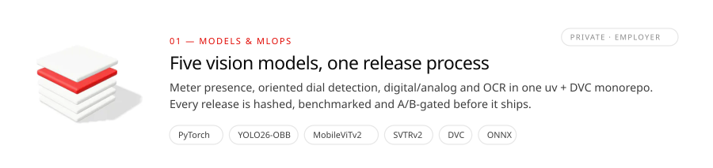

- Retrained the SVTRv2 reader for digital displays on production crops (96-px input, re-fit resize buckets, edge-replicated padding). Accuracy went **87.7% → 90.1%** on the full 3,965-image set, and **+8.7 pp** on low-quality photos.
- Every release records the git SHA, DVC revision, config, checkpoint and target runtime. PyTorch → ONNX parity is checked (max difference **1.2e-5**), and promotion is gated on p50/p95/p99 benchmarks and an A/B comparison.
- Made training **3.8× faster** on a DGX Spark (GB10): fused SDPA attention plus a static `torch.compile` took SVTRv2 from **80 → 305 img/s** and cut peak memory from **50.5 → 14.7 GB**.

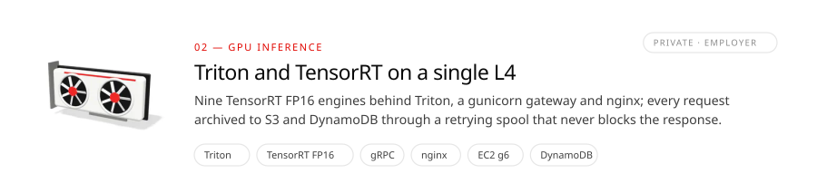

- Moved the meter classifier from ONNX Runtime to TensorRT, after patching a `Transpose` on a UINT8 input that TensorRT rejects. Compute went **309.5 → 3.3 ms**, single-image p50 at 16 concurrent went **873 → 47 ms**, and throughput went **19 → 321 img/s**. That removed a cliff where throughput *fell* as load rose.
- Load-tested one L4 with 67,719 requests: **181 img/s** sustained at p95 340 ms with zero errors, **12.6×** the production peak. Traced the ceiling to the host CPU (85–92% busy) while the GPU sat at ~45%.
- Replaced fire-and-forget archiving, which dropped **475** objects under burst load, with an on-disk spool that retries S3 and DynamoDB writes. Also added JSON error codes, request IDs and a Triton watchdog.

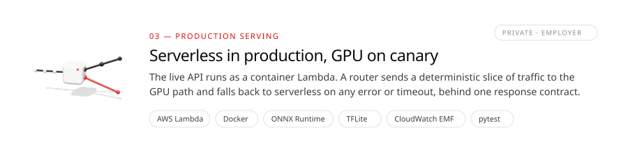

- Shipped frozen, checksummed releases of the production service. Exact match went **83.4% → 87.8%** on 2,950 labelled meter photos, and analog reads went **67.2% → 79.6%**.
- Root-caused a release regression to a CTC decoding bug: blank frames didn't reset the repeat check, so `4777.1` decoded as `47.1`. Accuracy had fallen to **64.2%**. The fix restored **84.0%**, and tests now pin it.
- Cut the container image from **4.43 → 2.2 GB**, and model loads for non-meter photos from **7 → 1**. Sized ONNX Runtime threads to the function's real vCPUs, and added SSRF-safe URL fetching, upload limits and CloudWatch EMF metrics.
- Built the router that exposes the GPU path to real traffic safely: a hash-based canary split, automatic fallback on any non-2xx response or 3-second timeout, and one response shape for both paths.

<b>How these numbers were measured</b>

 

- **Headline accuracy (79% → 91%):** measured on live production traffic over 40M meter readings, not on a test set.
- **Test-set accuracy** (the release and retraining figures): exact match of the whole reading, leading zeros ignored, on a fixed labelled set of 3,965 photos. The set has 2,950 meter photos (1,000 digital, 450 digital with decimals, 1,000 low-quality, 500 analog) and 1,015 non-meter photos, where the correct answer is "no reading". Every version is scored on the same images. The serverless release figures use only the 2,950 meter photos.
- **Latency:** end to end from an office network, with all 3,965 photos sent through each path. GPU path: p50 156 ms, p95 205 ms. Serverless: p50 1,415 ms, p95 1,714 ms.
- **Capacity:** a stepped load test of 67,719 requests against one g6.2xlarge (NVIDIA L4). "Sustained" means p95 ≤ 1 s with ≤ 0.5% errors. The production peak (14.4 requests/s) and the busiest day (330,707 requests) come from CloudWatch.
- **TensorRT:** the timings are model compute inside Triton. The p50 and throughput figures are single-image requests at 16 concurrent on a GB10.

The source repositories belong to my employer and are private. These figures are taken from their benchmark reports.

 

<a href="https://github.com/Lourdhu02/svtrv2">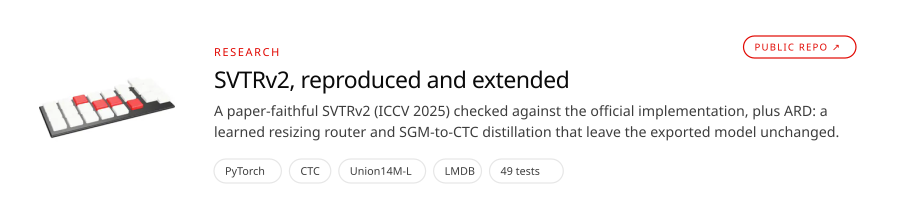</a>

- Checked the architecture against the official OpenOCR implementation: two 3×3 grouped-conv local mixing, W/4 timesteps, no positional embedding. There are 49 tests, including an end-to-end CPU training run.
- **ARD, part 1:** a small learned router replaces MSR's hand-set aspect-ratio buckets. It is trained with a Bradley–Terry preference loss on which canvas the recognizer reads best.
- **ARD, part 2:** the train-only semantic guidance module becomes a soft teacher for the CTC head, with uniform or Viterbi alignment (checked against brute force). The exported model stays byte-identical to the baseline.
- Status: implemented and tested. Benchmark runs are in progress, so there are no accuracy claims yet.

<a href="https://github.com/Lourdhu02/echome">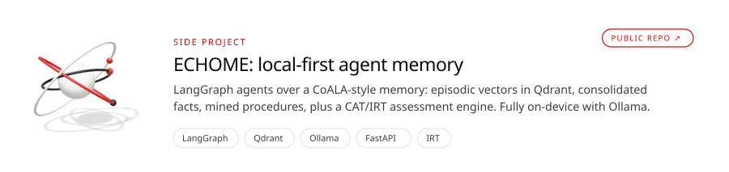</a>

<a href="https://github.com/Lourdhu02/fin-sentinal.ai">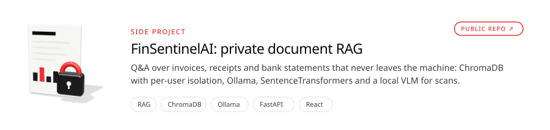</a>

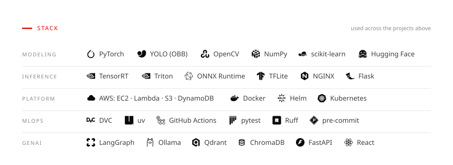


&nbsp;
&nbsp;

Every card and 3D render on this page is generated from code in <a href="assets/_build">assets/_build</a>.

