<picture>
  <source media="(prefers-color-scheme: dark)" srcset="assets/hero-dark.svg">
  
</picture>

[LinkedIn](https://www.linkedin.com/in/lourdhu) · [Email](mailto:b.lourdhuraju1234@gmail.com) · [Kaggle](https://www.kaggle.com/blourdhuraju)

I build computer-vision systems that hold up in production. At **Sujanix** I own an OCR platform that reads electricity meters for a state utility: I train the models, compile them to TensorRT, serve them on Triton and put a canary router in front. On the side I rebuild papers and build agents that remember. Production stays disciplined; the Jinx-style chaos stays in the notebook.

<picture>
  <source media="(prefers-color-scheme: dark)" srcset="assets/whoami-dark.svg">
  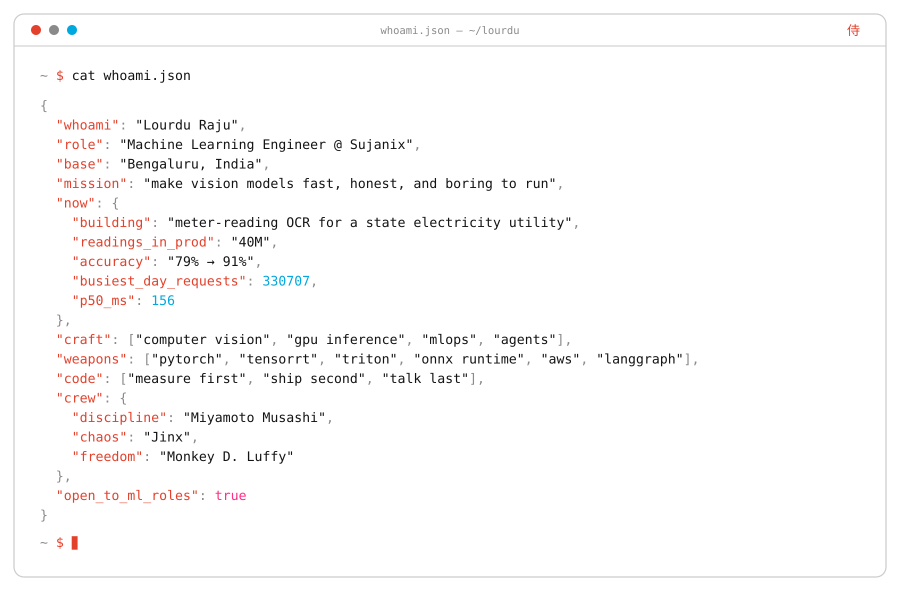
</picture>

 

<picture>
  <source media="(prefers-color-scheme: dark)" srcset="assets/h-work-dark.svg">
  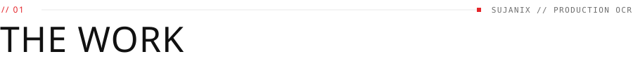
</picture>

At **Sujanix** I own the meter-reading OCR platform for a state electricity utility. One photo goes in and one reading comes out, up to **330K requests a day**.

<picture>
  <source media="(prefers-color-scheme: dark)" srcset="assets/fig01-pipeline-dark.svg">
  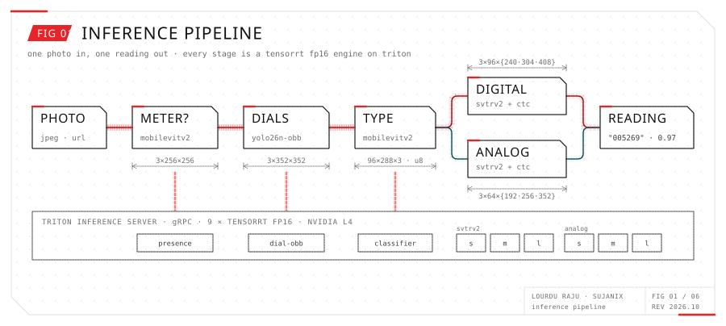
</picture>

<picture>
  <source media="(prefers-color-scheme: dark)" srcset="assets/fig02-serving-dark.svg">
  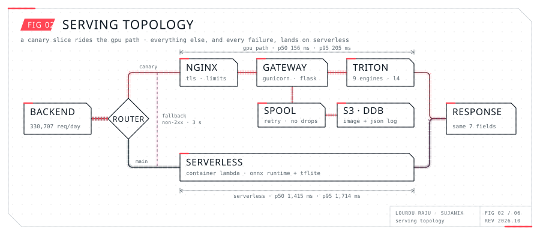
</picture>

| result | before | after | how |
|:--|--:|--:|:--|
| Reading accuracy | 79% | **91%** | live production traffic, 40M readings |
| End-to-end latency, p50 | 1,415 ms | **156 ms** | serverless → GPU path |
| Classifier compute | 309.5 ms | **3.3 ms** | ONNX Runtime → TensorRT FP16 |
| Throughput | 19 img/s | **321 img/s** | single-image requests, 16 concurrent |
| Capacity, one L4 GPU | – | **181 img/s** | p95 340 ms, 0 errors, 12.6× the production peak |
| Container image | 4.43 GB | **2.2 GB** | slimmed layers, then arm64 |
| SVTRv2 training | 80 img/s | **305 img/s** | fused SDPA + static `torch.compile` |

### Battle log

- **The decoder that ate digits.** A release fell to 64.2% exact match. The CTC decoder didn't reset its repeat check on blank frames, so `4777.1` came out as `47.1`. A one-line fix brought it back to 84.0%, and tests now pin it.
- **The cliff.** Throughput *dropped* as load rose. One classifier was still on ONNX Runtime. I moved it to TensorRT, after patching a `Transpose` on a UINT8 input that TensorRT rejects, and compute went from 309.5 ms to 3.3 ms.
- **The missing 475.** Fire-and-forget archiving lost 475 objects under burst load. I replaced it with an on-disk spool that retries S3 and DynamoDB until every write lands.
- **The wrong suspect.** At 181 img/s on one L4, the GPU sat at ~45% while the host CPU ran at 85–92%. Profile before you buy hardware.
- **The hardest photos.** I retrained the SVTRv2 reader on production crops (96-px input, re-fit resize buckets, edge-replicated padding). Low-quality photos gained +8.7 pp, and the test set went from 87.7% to 90.1% overall.

<b>How it ships</b>: one monorepo, frozen releases, a canary router (Fig 03)

 

<picture>
  <source media="(prefers-color-scheme: dark)" srcset="assets/fig03-release-dark.svg">
  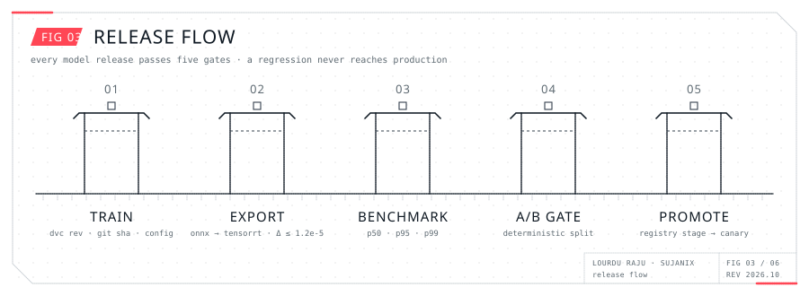
</picture>

- **One monorepo:** five models in a single uv + DVC repo. Every release records its git SHA, data version, config, checkpoint and runtime. PyTorch → ONNX parity is checked to 1.2e-5, and promotion is gated on p50/p95/p99 latency and an A/B run.
- **Frozen releases:** the serverless service ships as frozen, checksummed releases. Exact match went 83.4% → 87.8% on 2,950 labelled photos, and analog reads went 67.2% → 79.6%.
- **Canary router:** the router puts the GPU path in front of real traffic with a deterministic hash split. It falls back to serverless on any error or 3-second timeout, and both paths return one response shape.

<b>How these numbers were measured</b>

 

- **79% → 91%:** measured on live production traffic, over 40M readings.
- **Test-set figures:** exact match of the full reading, leading zeros ignored. The set holds 2,950 meter photos (1,000 digital, 450 with decimals, 1,000 low-quality, 500 analog) and 1,015 non-meter photos, where the correct answer is "no reading". Every version is scored on the same images.
- **Latency:** end to end from an office network, with all 3,965 test photos sent through each path. GPU path: p50 156 ms, p95 205 ms. Serverless: p50 1,415 ms, p95 1,714 ms.
- **Capacity:** a stepped load test of 67,719 requests on one g6.2xlarge (NVIDIA L4). "Sustained" means p95 ≤ 1 s with ≤ 0.5% errors. The production peak (14.4 req/s) and the busiest day (330,707 requests) come from CloudWatch.
- **TensorRT:** the timings are model compute inside Triton. Throughput is single-image requests at 16 concurrent on a GB10.
- **Sources:** the work repos belong to my employer and are private. These figures come from their benchmark reports.

 

<picture>
  <source media="(prefers-color-scheme: dark)" srcset="assets/h-research-dark.svg">
  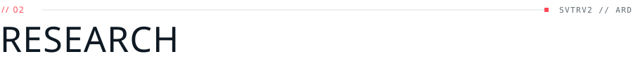
</picture>

### [svtrv2](https://github.com/Lourdhu02/svtrv2) · SVTRv2, rebuilt and extended

SVTRv2 (ICCV 2025) showed that a CTC-only recognizer can beat encoder–decoder models at scene text. I rebuilt it from the paper, checked it against the official OpenOCR code, and extended it with **ARD** (adaptive routing + semantic-guidance distillation). ARD targets two things the paper leaves on the table, and the exported model stays CTC-only.

- **Learned resize routing.** MSR picks each crop's canvas with hand-set aspect-ratio edges. A ~40k-parameter router picks it instead, trained with a **Bradley–Terry preference loss**: the canvas with the lower per-character CTC loss wins. It costs about 1–2% of step time.
- **SGM as a teacher.** SGM is normally thrown away at inference. Its left and right streams become a soft teacher for the CTC head at uniform- or Viterbi-aligned timesteps, with (1−β)·KL + β·CE and β = 0.2. Only the loss changes, so the exported network is the baseline's.
- **Data that can be trusted.** It trains straight from Union14M-L LMDBs (3.2M usable samples) and is set up to evaluate on 15 sets. The 12.9 GB data pack is checked against sha256 manifests; 25 of its 70 files arrived corrupt and were repaired.
- **Status.** 49 tests pass, 17 of them for ARD. Next: lock the paper baseline, then run a seven-way ablation. No accuracy claims until those runs finish.

<b>Fig 04</b>: where ARD sits around SVTRv2, and what the baseline covers

 

<picture>
  <source media="(prefers-color-scheme: dark)" srcset="assets/fig04-ard-dark.svg">
  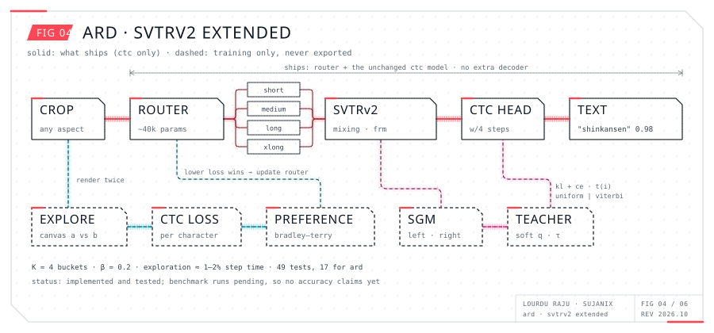
</picture>

- **Baseline:** local/global mixing built from two 3×3 grouped convs, W/4 timesteps, no positional embedding, FRM and a train-only SGM. Multi-size resizing (MSR) with bucketed batching, all four variants (t/s/b/xl) and a `--preset paper` recipe.
- **Router:** a depthwise-separable conv stem on a 32×128 probe, plus an aspect-ratio embedding. Every few steps, a few samples are rendered on two candidate canvases to produce the preference pairs.
- **Alignment:** the Viterbi path over the blank-extended alphabet is verified against brute-force path enumeration.
- **Evaluation sets:** the common six, seven Union14M-B subsets, LTB for long text and OST for occluded text.
- **Ablation plan:** uniform vs Viterbi, the router alone, full ARD, oracle routing, and refit static edges.

 

<picture>
  <source media="(prefers-color-scheme: dark)" srcset="assets/h-quests-dark.svg">
  
</picture>

### [echome](https://github.com/Lourdhu02/echome) · an agent that remembers

Most agents forget you between sessions. ECHOME is a local-first testbed for **persistent memory**: what happened (episodic), what it learned (semantic) and how you work (procedural). It is judged on whether that memory actually helps.

- **Three memory tiers.** Episodes are embedded with MiniLM into Qdrant and ranked by cosine similarity × recency decay. A local LLM consolidates them into semantic facts, and frequent action sequences are mined into procedures.
- **Orchestration.** LangGraph routes every turn: a local LLM classifies intent, memory is fetched before dispatch, and the reply is written back as an episode. The specialists are a tech agent and a bash agent that runs only allowlisted commands.
- **Personality as memory.** A computerized adaptive test (graded response model, Fisher-information item selection, an 80-item bank over 8 dimensions) supplies stable traits.
- **Evaluated, not vibed.** 12 scripted multi-session scenarios probe recall 2–52 turns later. Each runs as a three-way ablation: full memory, episodic-only and no memory. 72 unit tests.

<b>Fig 05</b>: ECHOME's memory loop

 

<picture>
  <source media="(prefers-color-scheme: dark)" srcset="assets/fig05-echome-dark.svg">
  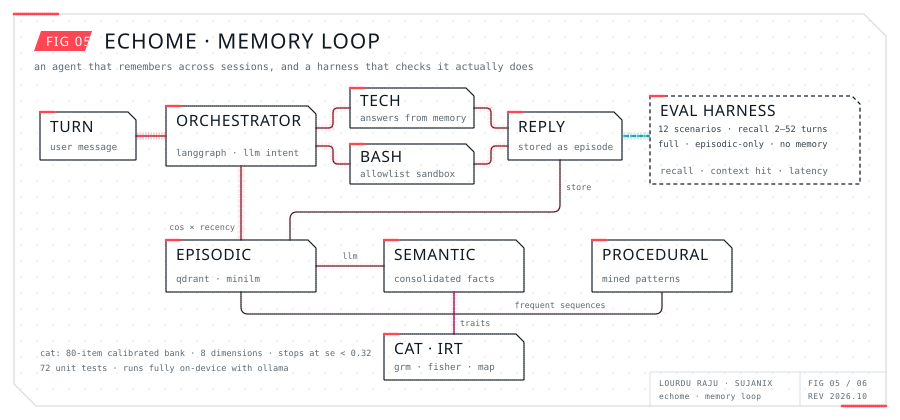
</picture>

- Embedding, intent classification and consolidation each have a deterministic fallback: hashing embeddings, extractive consolidation.
- The harness reports recall, context-hit rate and retrieval latency against store size.
- Rebuilt after a self-audit: every part that started as a stub (memory, routing, agents, sandboxing) is now real and tested. The write-up in progress is *a three-tier persistent memory architecture for personalized agents*.

### [finsentinel.ai](https://github.com/Lourdhu02/fin-sentinal.ai) · financial-document RAG that never leaves the machine

Ask questions about invoices, bank statements and payslips without uploading them anywhere.

- **Private by construction.** FastAPI with JWT auth. Each user's files land in their own folder, and every vector search filters on that user's session tag. Embeddings run on CPU, answers come from a local Ollama model, and every question goes to an audit log.
- **Ingest.** pdfplumber for PDFs and Tesseract OCR for scans, plus CSV, JSON, Markdown and HTML. Chunks are embedded with all-MiniLM-L6-v2 (384-d) and stored in ChromaDB.
- **Answer.** Top-20 vector search over the user's own documents, reranked to 10 by a cross-encoder. Ollama answers with the last six turns of context and returns its sources.
- **Next, built and being wired in.** A rule-based extractor for six document types, invoice math checks (±0.05), Isolation Forest + z ≥ 3 anomaly scoring, and exact SQL answers so totals never come from the LLM.

<b>Fig 06</b>: FinSentinelAI's ingest and ask paths

 

<picture>
  <source media="(prefers-color-scheme: dark)" srcset="assets/fig06-finsentinel-dark.svg">
  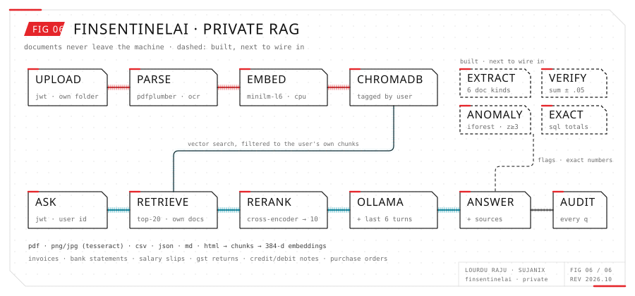
</picture>

 

<picture>
  <source media="(prefers-color-scheme: dark)" srcset="assets/h-loadout-dark.svg">
  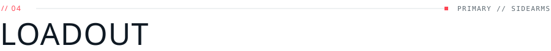
</picture>

<picture>
  <source media="(prefers-color-scheme: dark)" srcset="assets/loadout-dark.svg">
  
</picture>

 

<picture>
  <source media="(prefers-color-scheme: dark)" srcset="assets/h-career-dark.svg">
  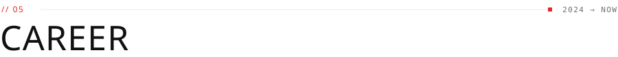
</picture>

| when | role | where | what |
|:--|:--|:--|:--|
| **2026 → now** | ML engineer | Sujanix | meter-reading OCR: models → TensorRT → production |
| **2024 → 2025** | Founder | Spacedrift | ML builds, data annotation, research support |
| **2024** | Data science intern | Brainovision | forecasting with GBM ensembles, +15% accuracy |

Kaggle Notebooks Expert · Machine Learning Specialization (DeepLearning.AI, Stanford) · Data Science with Python (NPTEL, IIT Madras)

 

<picture>
  <source media="(prefers-color-scheme: dark)" srcset="assets/h-rules-dark.svg">
  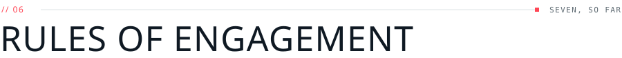
</picture>

1. Measure before you claim.
2. A model isn't done until it survives production.
3. Read the decoder before you blame the model.
4. Profile before you buy hardware.
5. Never drop data silently.
6. Ship behind a canary, and keep a fallback.
7. Delete more than you add.

 

  The One Piece is real: it's a model that still works in production. 
  <a href="https://www.linkedin.com/in/lourdhu">LinkedIn</a> · <a href="mailto:b.lourdhuraju1234@gmail.com">Email</a> · <a href="https://www.kaggle.com/blourdhuraju">Kaggle</a>

