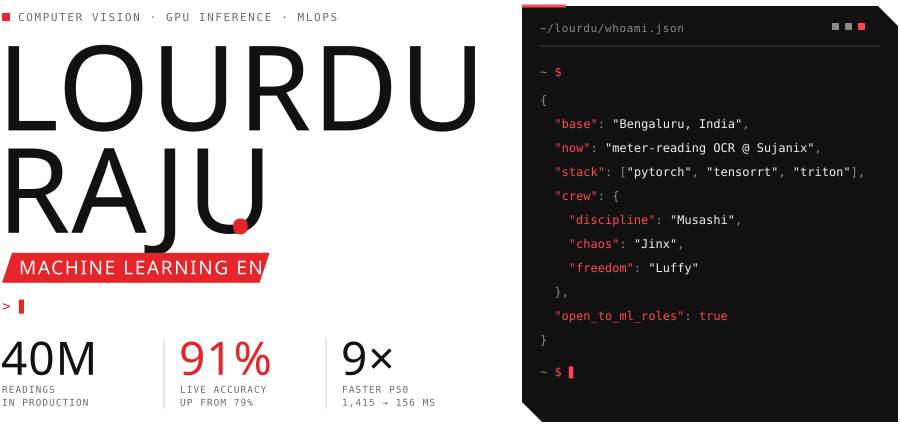
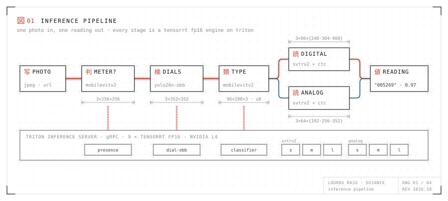
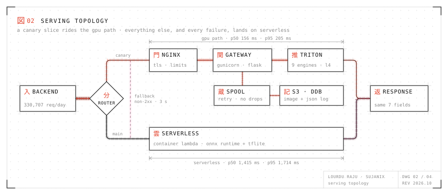
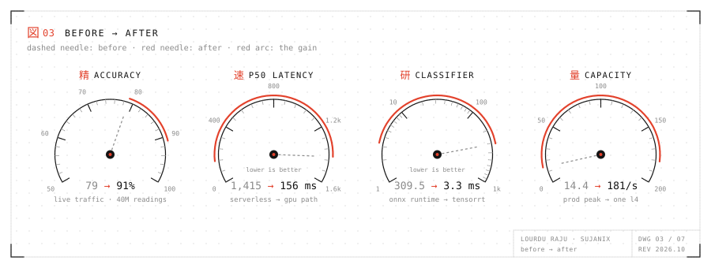
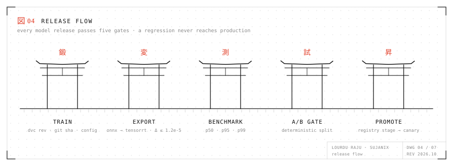
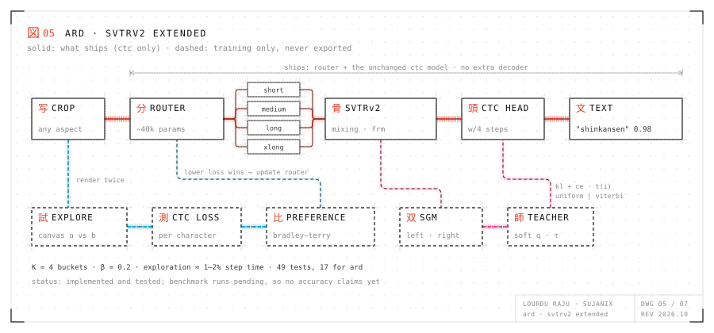
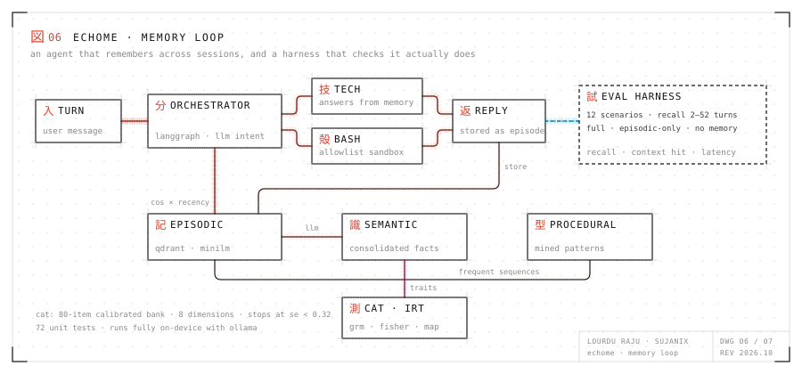
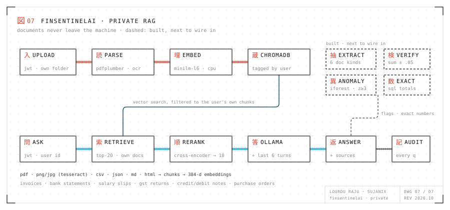

<picture>
  <source media="(prefers-color-scheme: dark)" srcset="assets/hero-dark.svg">
  
</picture>

[linkedin](https://www.linkedin.com/in/lourdhu) · [email](mailto:b.lourdhuraju1234@gmail.com) · [kaggle](https://www.kaggle.com/blourdhuraju)

I build computer-vision systems that hold up in production. Right now that means an OCR platform that reads electricity meters for a state utility: I train the models, compile them to TensorRT, serve them on Triton, and put a canary router in front. I keep production disciplined and leave the Jinx-style chaos in the notebook.

<picture>
  <source media="(prefers-color-scheme: dark)" srcset="assets/whoami-dark.svg">
  
</picture>

<picture>
  <source media="(prefers-color-scheme: dark)" srcset="assets/katana-dark.svg">
  
</picture>

## 壱 · the work

At **Sujanix** I own the meter-reading OCR platform for a state electricity utility. One photo goes in and one reading comes out. On the busiest day that was 330K requests.

<picture>
  <source media="(prefers-color-scheme: dark)" srcset="assets/dwg01-pipeline-dark.svg">
  
</picture>

<picture>
  <source media="(prefers-color-scheme: dark)" srcset="assets/dwg02-serving-dark.svg">
  
</picture>

<picture>
  <source media="(prefers-color-scheme: dark)" srcset="assets/dwg03-gauges-dark.svg">
  
</picture>


```text
                          before      after
reading accuracy          79%         91%         live traffic · 40M readings
end-to-end latency, p50   1,415 ms    156 ms      serverless → gpu path
classifier compute        309.5 ms    3.3 ms      onnx runtime → tensorrt fp16
throughput                19 img/s    321 img/s   single image · 16 concurrent
capacity, one l4 gpu      -           181 img/s   p95 340 ms · 0 errors · 12.6× prod peak
container image           4.43 GB     2.2 GB      slimmed layers, then arm64
svtrv2 training           80 img/s    305 img/s   fused sdpa + static torch.compile
```

### 戦 · battle log

- **The decoder that ate digits.** A release fell to 64.2% exact match. The CTC decoder didn't reset its repeat check on blank frames, so `4777.1` came out as `47.1`. A one-line fix brought it back to 84.0%, and tests now pin it.
- **The cliff.** Throughput *dropped* as load rose. One classifier was still on ONNX Runtime. I moved it to TensorRT, after patching a `Transpose` on a UINT8 input that TensorRT rejects, and compute went from 309.5 ms to 3.3 ms.
- **The missing 475.** Fire-and-forget archiving lost 475 objects under burst load. I replaced it with an on-disk spool that retries S3 and DynamoDB until every write lands.
- **The wrong suspect.** At 181 img/s on one L4, the GPU sat at ~45% while the host CPU ran at 85–92%. Profile before you buy hardware.
- **The hardest photos.** I retrained the SVTRv2 reader on production crops (96-px input, re-fit resize buckets, edge-replicated padding). Low-quality photos gained +8.7 pp, and the test set went from 87.7% to 90.1% overall.

### 道 · how it ships

<picture>
  <source media="(prefers-color-scheme: dark)" srcset="assets/dwg04-release-dark.svg">
  
</picture>

- **One monorepo:** five models in a single uv + DVC repo. Every release records its git SHA, data version, config, checkpoint and runtime. PyTorch → ONNX parity is checked to 1.2e-5, and promotion is gated on p50/p95/p99 latency and an A/B run.
- **Frozen releases:** the serverless service ships as frozen, checksummed releases. Exact match went 83.4% → 87.8% on 2,950 labelled photos, and analog reads went 67.2% → 79.6%.
- **Canary router:** the router puts the GPU path in front of real traffic with a deterministic hash split. It falls back to serverless on any error or 3-second timeout, and both paths return one response shape.

<details>
<summary>how these numbers were measured</summary>
<br>

- **79% → 91%:** measured on live production traffic, over 40M readings.
- **Test-set figures:** exact match of the full reading, leading zeros ignored. The set holds 2,950 meter photos (1,000 digital, 450 with decimals, 1,000 low-quality, 500 analog) and 1,015 non-meter photos, where the correct answer is "no reading". Every version is scored on the same images.
- **Latency:** end to end from an office network, with all 3,965 test photos sent through each path. GPU path: p50 156 ms, p95 205 ms. Serverless: p50 1,415 ms, p95 1,714 ms.
- **Capacity:** a stepped load test of 67,719 requests on one g6.2xlarge (NVIDIA L4). "Sustained" means p95 ≤ 1 s with ≤ 0.5% errors. The production peak (14.4 req/s) and the busiest day (330,707 requests) come from CloudWatch.
- **TensorRT:** the timings are model compute inside Triton. Throughput is single-image requests at 16 concurrent on a GB10.
- **Sources:** the work repos belong to my employer and are private. These figures come from their benchmark reports.

</details>

## 弐 · research

### [svtrv2](https://github.com/Lourdhu02/svtrv2) · SVTRv2, rebuilt and extended

SVTRv2 (ICCV 2025) showed that a CTC-only recognizer can beat encoder–decoder models at scene text. I rebuilt it from the paper, checked it against the official OpenOCR code, and extended it with **ARD** (adaptive routing + semantic-guidance distillation). ARD targets two things the paper leaves on the table, and the deployed model stays CTC-only.

<picture>
  <source media="(prefers-color-scheme: dark)" srcset="assets/dwg05-ard-dark.svg">
  
</picture>

- **A faithful baseline.**
  - Local/global mixing built from two 3×3 grouped convs, W/4 timesteps, no positional embedding, FRM, and a train-only SGM.
  - Multi-size resizing (MSR) with bucketed batching, all four variants (t/s/b/xl), and a `--preset paper` recipe.
- **Problem 1: the resize bucket is picked by a fixed rule.** MSR assigns each crop a canvas from hand-set aspect-ratio edges. That rule can't see which canvas the recognizer actually reads best.
  - A ~40k-parameter router (a depthwise-separable conv stem on a 32×128 probe, plus an aspect-ratio embedding) picks the bucket instead.
  - It learns from a **Bradley–Terry preference loss**: every few steps, a few samples are rendered on two candidate canvases, and the one with the lower per-character CTC loss wins.
  - Overhead is about 1–2% of step time.
- **Problem 2: SGM is thrown away at inference.**
  - Its left and right streams become a soft teacher for the CTC head, at timesteps aligned either uniformly or by Viterbi over the blank-extended alphabet. The Viterbi alignment is verified against brute-force path enumeration.
  - The loss is (1−β)·KL + β·CE with β = 0.2. Distillation changes only the loss, so the exported model is exactly the baseline CTC network.
- **Data that can be trusted.**
  - Trains straight from Union14M-L LMDBs: 3.2M usable samples, no image extraction.
  - Set up to evaluate on 15 sets: the common six, seven Union14M-B subsets, LTB for long text and OST for occluded text.
  - The 12.9 GB data pack is checked against sha256 manifests. 25 of its 70 files arrived corrupt and were repaired.
- **Status:**
  - 49 tests pass, 17 of them for ARD.
  - Next: lock the paper baseline, then run a seven-way ablation (uniform vs Viterbi, the router alone, full ARD, oracle routing, refit static edges).
  - No accuracy claims until those runs finish.

## 参 · side quests

### [echome](https://github.com/Lourdhu02/echome) · an agent that remembers

Most agents forget you between sessions. ECHOME is a local-first testbed for **persistent memory**: what happened (episodic), what it learned (semantic) and how you work (procedural). It is measured on whether that memory actually helps.

<picture>
  <source media="(prefers-color-scheme: dark)" srcset="assets/dwg06-echome-dark.svg">
  
</picture>

- **Memory in three tiers (CoALA-style).**
  - Episodes are embedded (MiniLM, with a deterministic hashing fallback) into Qdrant.
  - Retrieval ranks by cosine similarity × exponential recency decay.
  - A local LLM consolidates clusters of episodes into semantic facts, with an extractive fallback.
  - Frequent action sequences are mined into procedures.
- **Orchestration.**
  - LangGraph routes every turn: a local LLM classifies intent (with a deterministic fallback), memory is fetched before dispatch, and every turn is written back as a new episode.
  - The specialists are a tech agent that answers from retrieved memory, and a bash agent that runs only allowlisted commands.
- **Personality as memory.** A computerized adaptive test supplies stable traits to semantic memory. It uses a graded response model, Fisher-information item selection and MAP θ estimation, over an 80-item calibrated bank covering 8 dimensions.
- **Evaluated, not vibed.**
  - 12 scripted multi-session scenarios plant facts and probe them 2–52 turns later.
  - Each scenario runs as a three-way ablation: full memory, episodic-only, and no memory. The harness reports recall, context-hit rate and retrieval latency against store size.
  - 72 unit tests.
- **Rebuilt after a self-audit.** Every part that started as a stub (memory, routing, agents, sandboxing) is now real and tested. The write-up in progress is *a three-tier persistent memory architecture for personalized agents*.

### [finsentinel.ai](https://github.com/Lourdhu02/fin-sentinal.ai) · financial-document RAG that never leaves the machine

Ask questions about invoices, bank statements and payslips without uploading them anywhere.

<picture>
  <source media="(prefers-color-scheme: dark)" srcset="assets/dwg07-finsentinel-dark.svg">
  
</picture>

- **Private by construction.**
  - FastAPI with JWT auth.
  - Each user's files land in their own folder, and their chunks carry a session tag that every vector search filters on.
  - Embeddings run on CPU, answers come from a local Ollama model, and every question goes to an audit log.
- **Ingest.**
  - PDFs go through pdfplumber and scans (PNG/JPG/TIFF) through Tesseract OCR, plus CSV, JSON, Markdown and HTML.
  - Text is chunked, embedded with all-MiniLM-L6-v2 (384-d) and stored in ChromaDB.
- **Answer.** Top-20 vector search over the user's own documents, reranked to 10 by a cross-encoder (ms-marco-MiniLM-L-6-v2). Ollama then answers with the last six turns of context and returns its sources.
- **Next, already built and being wired in:**
  - A rule-based extractor for six document types.
  - Invoice math checks (subtotal + tax must equal the total within 0.05).
  - Anomaly scoring with an Isolation Forest plus a z ≥ 3 rule.
  - Exact SQL answers for totals, counts and vendor spend, so numbers never come from the LLM.

## 肆 · arsenal

<picture>
  <source media="(prefers-color-scheme: dark)" srcset="assets/arsenal-dark.svg">
  
</picture>

## 伍 · path

```text
2026 ─ now    ml engineer   sujanix        meter-reading ocr: models → tensorrt → production
2024 ─ 2025   founder       spacedrift     ml builds, data annotation, research support
2024          ds intern     brainovision   forecasting with gbm ensembles, +15% accuracy
```

kaggle notebooks expert · machine learning specialization (deeplearning.ai, stanford) · data science with python (nptel, iit madras)

## 陸 · my dokkōdō

Musashi left 21 precepts. These are mine, so far:

1. Measure before you claim.
2. A model isn't done until it survives production.
3. Read the decoder before you blame the model.
4. Profile before you buy hardware.
5. Never drop data silently.
6. Ship behind a canary, and keep a fallback.
7. Delete more than you add.

<picture>
  <source media="(prefers-color-scheme: dark)" srcset="assets/katana-dark.svg">
  
</picture>

<p align="center">
  <sub>The One Piece is real: it's a model that still works in production.</sub><br>
  <sub><a href="https://www.linkedin.com/in/lourdhu">linkedin</a> · <a href="mailto:b.lourdhuraju1234@gmail.com">email</a> · <a href="https://www.kaggle.com/blourdhuraju">kaggle</a></sub>
</p>
